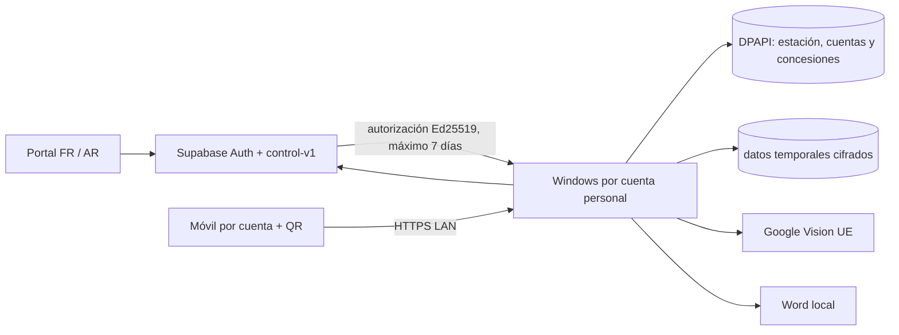

# Fase 2 · Plan del piloto SaaS híbrido

Fecha base: 2026-09-20. Objetivo: habilitar un piloto controlado de **Valiris Desk**, producto de la marca Valiris, en un máximo de cinco despachos marroquíes, con entre uno y tres PC por despacho, manteniendo los datos notariales en el despacho.

## Resultado que debe recibir el despacho

El titular crea su acceso con MFA, invita operadores y activa los PC autorizados. Cada persona entra con su cuenta tanto en Windows como en el móvil. El operador trabaja únicamente con sus expedientes temporales; el titular puede supervisar los de la estación. La licencia puede verificarse en línea y deja una autorización firmada de hasta siete días para trabajar sin conexión. Cuando termina, la aplicación bloquea trabajo nuevo y conserva 24 horas para revisar y guardar los Word ya iniciados.

La experiencia completa está disponible en francés y árabe, con francés inicial y RTL real al elegir árabe. Ninguna pantalla operativa del piloto debe depender del español.

El arranque comercial se hará con coste operativo adicional de 0 €: Cloudflare Pages, SMTP transaccional, Supabase y Google Vision permanecerán en sus niveles gratuitos mientras se validan los primeros cinco despachos. Antes de incorporar el sexto despacho se revisarán uso, continuidad, copias y soporte para decidir el paso a planes de pago. Se adelantará esa revisión si cualquier límite gratuito afecta a autenticación, correo, OCR o disponibilidad.

La compra del certificado Authenticode puede aplazarse durante la preparación técnica. Las compilaciones sin una firma pública de confianza se consideran internas y pueden mostrar una advertencia de Windows; la firma confiable continúa siendo un gate antes de una distribución comercial autónoma.

## Arquitectura de referencia

El control SaaS no recibe imágenes CNIE, resultados OCR, expedientes ni documentos Word. Supabase almacena identidad de cuenta, membresía, licencia, estación y auditoría administrativa.

## Secuencia de entrega

### 1. Producto listo para desplegar

- Revisar y pulir los textos FR/AR ya integrados en Windows y móvil, incluidos errores y atributos de accesibilidad, con hablantes de ambos idiomas.
- Revisar visualmente las pantallas principales en 1366×768, móvil estrecho y árabe RTL; corregir desbordes y dirección de controles si aparecen.
- Añadir configuración de compilación reproducible para URL Supabase, clave publicable y clave pública Ed25519.
- Criterio de salida: búsquedas automáticas no encuentran cadenas operativas en español y los flujos de captura, revisión y Word funcionan en ambos idiomas.

### 2. Infraestructura de control

- Crear Supabase en Frankfurt en el nivel gratuito para el primer piloto; el ensayo seguirá siendo local para no duplicar infraestructura. Revisar el paso a producción de pago antes del sexto despacho o antes si los límites afectan al servicio.
- Aplicar migración y función `control-v1`; configurar Auth, SMTP, dominio del portal y redirecciones permitidas.
- Crear fuera del repositorio la clave Ed25519 de licencias. El secreto queda únicamente en Supabase; Windows recibe solo `kid` y clave pública.
- Criterio de salida: un administrador puede crear un despacho/licencia y un titular invitado puede completar contraseña y MFA.

### 3. Paquete Windows del piloto

- Compilar la característica `control` contra producción, firmar instalador y publicar la versión mediante el canal acordado.
- Validar instalación limpia, activación, reinicio, renovación, sesión sin conexión y desinstalación/reinstalación controlada.
- Criterio de salida: una estación no puede reutilizar la activación de otra, el token de arranque no accede a datos y una estación revocada deja de renovar.

### 4. Ensayo de despacho

- Crear dos despachos de prueba, dos operadores en uno de ellos y al menos una estación por despacho.
- Ejecutar el recorrido: invitación, MFA, activación, captura móvil, OCR, revisión, expediente, Word, cierre y limpieza.
- Desconectar la red después de renovar y comprobar los límites de siete días y 24 horas con reloj controlado.
- Criterio de salida: no hay lectura cruzada entre despachos ni operadores, y ningún dato documental aparece en Supabase.

### 5. Piloto gradual

- Incorporar primero un despacho durante varios días; después ampliar hasta cinco si no aparecen incidencias bloqueantes.
- Registrar solo eventos operativos mínimos: autenticación, invitación, estación, licencia, renovación y revocación. No registrar datos CNIE.
- Preparar procedimiento de soporte para cambio de PC, pérdida de MFA, estación revocada, Google Vision y recuperación de acceso.
- Criterio de salida: cada despacho completa al menos un flujo real de captura a Word y el titular puede administrar usuarios y PC sin ayuda técnica.

## Criterios de aceptación finales

- Titular y operador acceden con cuenta personal; el titular usa TOTP obligatorio.
- Móvil requiere cuenta y QR, y no acepta la cuenta de otro operador para ese QR.
- Un operador no puede listar, abrir ni modificar expedientes de otro operador. El titular de la estación sí puede hacerlo.
- Un despacho nunca puede consultar miembros, estaciones o licencias de otro despacho.
- La autorización local es verificable sin red, está ligada al UUID y correo de la cuenta, al despacho y a la estación, dura como máximo siete días y detecta retroceso de reloj.
- Tras vencer trabajo nuevo se rechazan capturas, expedientes y solicitudes Word parciales nuevas; los expedientes y solicitudes ya creados permiten revisión y guardado Word durante un máximo de 24 horas.
- Francés y árabe cubren acceso, captura, OCR, revisión, expedientes, Word, administración, errores y accesibilidad; árabe usa RTL sin romper datos latinos.
- Supabase no contiene imágenes, OCR, campos CNIE, expedientes ni Word.
- El instalador está firmado y la clave privada de licencias no forma parte del código, del instalador ni de las variables del cliente.

## Límites deliberados del piloto

No se incluye autoservicio de pago, facturación automática, analítica documental, almacenamiento CNIE en la nube, colaboración entre estaciones sobre el mismo expediente ni una consola compleja de soporte. Estas funciones no son necesarias para validar el SaaS híbrido y aumentarían el riesgo antes de observar el piloto.
